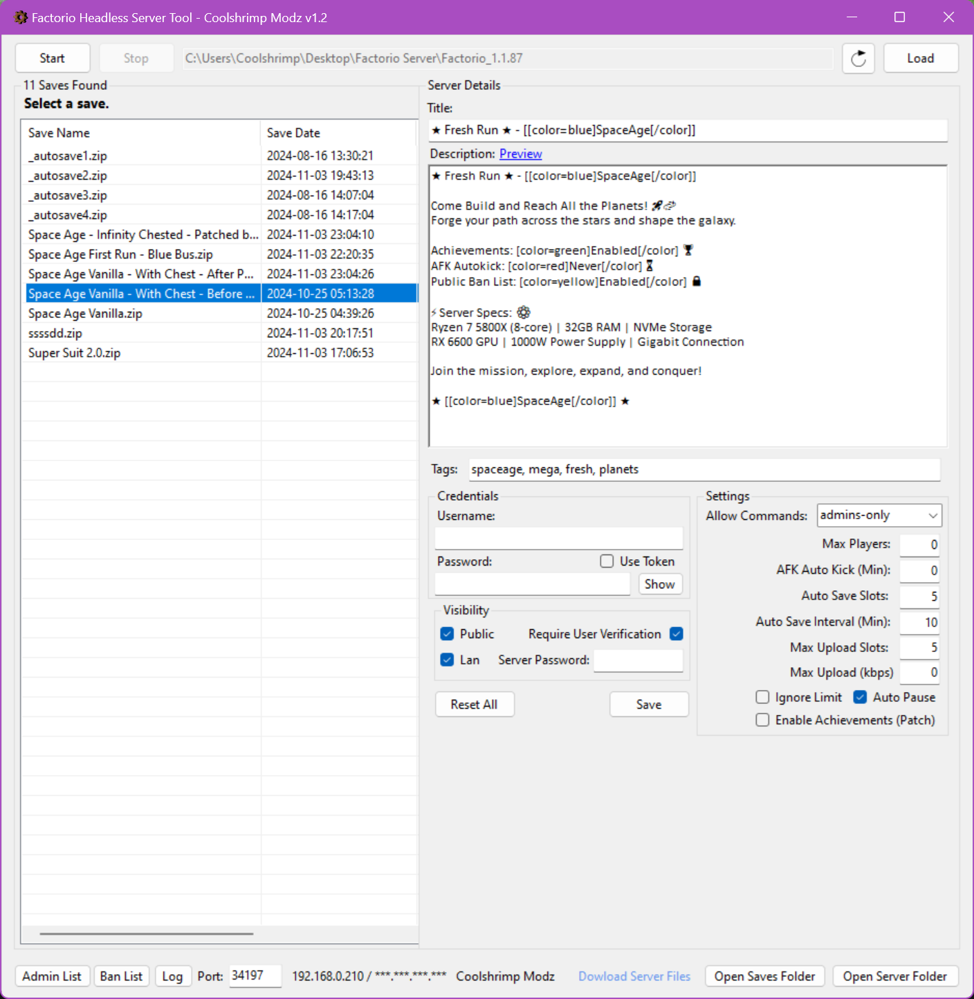

# Factorio-Headless-Server-Tool

**Factorio Headless Server Tool** is a Windows-based utility designed to simplify the management of headless Factorio servers. With this tool, you can easily manage saves, configure settings, and start or stop your server without needing to navigate complex command-line options.

## Features

- **Start/Stop Server**: Easily start and stop your Factorio headless server with the click of a button.
- **Save Management**: View, load, and delete save files directly from the interface.
- **Server Configuration**: Customize server settings, such as server name, description, max players, and more.
- **IP Address Display**: Shows local and public IP addresses, with options to copy them to your clipboard.
- **User Preferences**: Save and load preferences like server port, username, password, and token.
- **Console Log**: View program logs in real-time with a dedicated console window.
- **Backup and Restore**: Create backups of save files and restore them as needed.
- **Achievements Patch Feature**: Unlock achievements on modified save files by bypassing restrictions that normally prevent achievements.

## Installation

1. **Download** the compiled executable from the [Releases]([(https://github.com/coolshrimp/Factorio-Headless-Server-Tool/releases/)](https://github.com/coolshrimp/Factorio-Headless-Server-Tool/releases/)]) section.
2. **Run the executable**—no installation required.

## Usage

1. **Select Factorio Server Folder**: When prompted, choose your Factorio server directory.
   - If you don’t have a Factorio server, click the **Download** button in the tool to download `server.zip`.
   - Extract this file, then select the extracted Factorio server folder.
     
2. **Saves Folder**: Ensure your save files are located in the `saves` folder inside the Factorio server directory. The tool allows you to explore and manage these saves.

3. **Achievements Patch**: For modified saves where achievements have been disabled, you can use the **Achievements Patch Feature** to reactivate achievements. Note: This may be considered a form of modification and is generally intended for personal use only.

## Requirements

- **Windows OS** (Tested on Windows 10 and later)
- **Latest Official Factorio Server Files** Unzipped ([Download Factorio Server](https://www.factorio.com/download))
- **.NET 6.0 Desktop Runtime** or later ([Download .NET Runtime](https://dotnet.microsoft.com/en-us/download/dotnet/thank-you/runtime-desktop-6.0.35-windows-x64-installer))

## Troubleshooting

- **Settings Not Saving**: Ensure the tool is running with write permissions to save configuration files.
- **Server Not Starting**: Verify the Factorio server path and check for any missing dependencies.
- **Console Log Not Displayed**: Confirm the console log window is not minimized and is attached to the main form.
- **Achievements Not Unlocking**: Make sure the achievements patch is applied to a compatible save file and restart the server.

## Acknowledgments

- [Factorio](https://factorio.com/) for their fantastic game.
- Community resources and documentation for Factorio headless servers.
- FactorioSaveGameEnableAchievements (https://github.com/Rainson12/FactorioSaveGameEnableAchievements)
